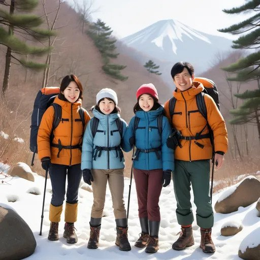
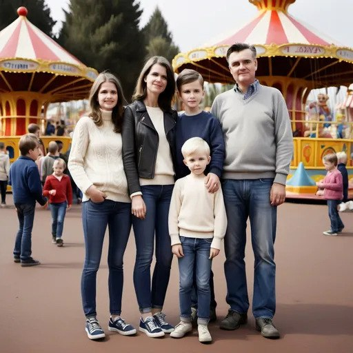

🏖️ Holiday Planning: Where Should They Go?
🎯 Level: Elementary (A1–A2)
🔧 Skills Practiced: Speaking, Reading, Functional Phrases (likes, wants, doesn'th like)
👥 Interaction: Pair or Group Work

## Foydali iboralar (Useful phrases):
- **yaxshi ko'rmoq** - to like
- **yoqtirmoq** - to enjoy  
- **xohlamoq** - to want
- **...uchun yaxshi** - good for...
- **...uchun yomon** - bad for...
- **issiq/sovuq havo** - hot/cold weather
- **tinch/shovqinli** - quiet/noisy
- **sayohat qilish** - to travel
- **chunki** - because
- **lekin** - but
- **va** - and

## Fikr bildirish va taqqoslash (Expressing opinions and comparing):

### Fikr bildirish (Expressing opinions):
- **Menimcha...** - I think that...
- **Mening fikrimcha...** - In my opinion...
- **Men ishonamanki...** - I believe that...
- **Menga tuyuladi...** - It seems to me...

### Taqqoslash (Comparing options):
- **...dan yaxshiroq** - better than...
- **eng yaxshi variant** - the best option
- **...ga ko'ra afzalroq** - preferable to...
- **...uchun eng mos** - most suitable for...
- **Ispaniya bu oila uchun Kanadadan yaxshiroq variant** - Spain is a better option for this family than Canada
- **Bu Smith oilasiga eng mos keladi** - This suits the Smiths best
- **...ga ko'ra ko'proq mos keladi** - suits better than...

### Afzallik va kamchiliklar (Advantages and disadvantages):
- **afzalligi** - advantage
- **kamchiligi** - disadvantage  
- **ijobiy tomoni** - positive side
- **salbiy tomoni** - negative side
- **Smith oilasi uchun Ispaniya variantining afzalligi shundaki...** - An advantage of Spain option for the Smiths family is that...
- **Smith oilasi uchun Ispaniya variantining kamchiligi shundaki...** - A disadvantage of Spain option for the Smiths family is that...
- **Eng katta afzalligi...** - The biggest advantage is...
- **Asosiy muammo shundaki...** - The main problem is that...

✏️ Task Instructions (Student-friendly)

Read about the families. Then read about the holiday places.
Talk with your partner. Choose the best holiday for each family.
Say why the place is good (or not good) for them.

Use sentences like:
✅ "Ular suzishni yaxshi ko'radilar. Plyaj yaxshi." (They like swimming. The beach is good.)
✅ "Ular issiq ob-havoni yoqtirmaydilar. Plyaj yaxshi emas." (They don't like hot weather. The beach is not good.)

👨‍👩‍👧‍👦 Data Set 1: The Families

| Oila nomi | Yaxshi ko'radilar | Yoqtirmaydilar | Xohlaydilar |
|-----------|-------------------|----------------|-------------|
| The Browns | Suzish, issiq havo | Uchish | Issiq joy |
| The Khans | Sayr qilish, sovuq havo | Suzish | Tinch joy |
| The Smiths | Istirohat bog'lari, quyosh | Sovuq havo | Bolalar uchun qiziqarli |
| The Yamadas | Tabiat, piyoda sayohat, sovuq havo | Uzoq mashina safari | Tog'lar |

  
  
  
  

🌍 Data Set 2: Holiday Places

  

    <strong>🏝️ Sunny Beach (Spain)</strong> 
    - Sayohat: 3 soatlik parvoz ✈️ 
    - Ob-havo: Issiq va quyoshli ☀️ 
    - Faoliyat: Suzish, quyoshda yotish, plyaj o'yinlari 
    - Shovqin: Band va shovqinli
  

  

    
  

  

    <strong>🏔️ Snowy Mountains (Canada)</strong> 
    - Sayohat: 5 soatlik parvoz ✈️ 
    - Ob-havo: Sovuq va qorli ❄️ 
    - Faoliyat: Piyoda sayohat, chang'i uchish, tabiatda sayr 
    - Shovqin: Juda tinch
  

  

    
  

  

    <strong>🎡 HappyLand Amusement Park (USA)</strong> 
    - Sayohat: 2 soatlik mashina safari 🚗 
    - Ob-havo: Iliq va quyoshli ☀️ 
    - Faoliyat: Amerikacha chayqalish, shou, bolalar uchun o'yinlar 
    - Shovqin: Juda band va shovqinli
  

  

    
  

  

    <strong>🌲 Forest Lake (Finland)</strong> 
    - Sayohat: 1 soatlik mashina safari 🚗 
    - Ob-havo: Sovuq va tinch ❄️ 
    - Faoliyat: Tabiat sayrlar, qayiqda suzish, tinch kechalar 
    - Shovqin: Juda tinch
  

  

    
  

💬 Speaking Prompts

👂 "The Browns nimani yaxshi ko'radilar?"
🗣️ "Ular suzish va issiq havoni yaxshi ko'radilar."

👂 "Sunny Beach ular uchun yaxshimi?"
🗣️ "Ha! U yerda issiq va ular suzishlari mumkin."

👂 "The Khans uchun qaysi joy eng yaxshi?"
🗣️ "Forest Lake yaxshi, chunki u tinch va ular sayr qilishni yaxshi ko'radilar."

👂 "Nima uchun The Smiths HappyLand Amusement Park ga borishlari kerak?"
🗣️ "Chunki ular istirohat bog'larini yaxshi ko'radilar va u yerda bolalar uchun ko'p qiziqarli narsalar bor."

👂 "The Yamadas uchun qaysi joy eng yomon?"
🗣️ "HappyLand Amusement Park yomon, chunki u uzoq mashina safaridir va ular buni yoqtirmaydilar."

## Learning Objectives:
- Develop reading and comprehension skills
- Enhance problem-solving abilities
- Practice pair and group collaboration
- Learn comparison and decision-making
- Express personal opinions
- Explain cause-and-effect relationships

## Additional Practice Questions:
1. Which family has the most vacation options? Why?
2. Which holiday destination would be most popular? Why?
3. Which family would you like to vacation with? Why?
4. Which place do you think would be the most expensive?

## Teacher Instructions:
1. Ensure students first understand each family's characteristics clearly
2. Encourage students to justify their choices
3. Promote the use of "chunki..." (because) in explanations
4. Give each student a chance to speak about at least one family
5. There are no wrong answers - the important thing is reasoning
6. Encourage students to share their own vacation experiences

## Extension Activity:
Students can describe their ideal vacation destination and present it to the class.
